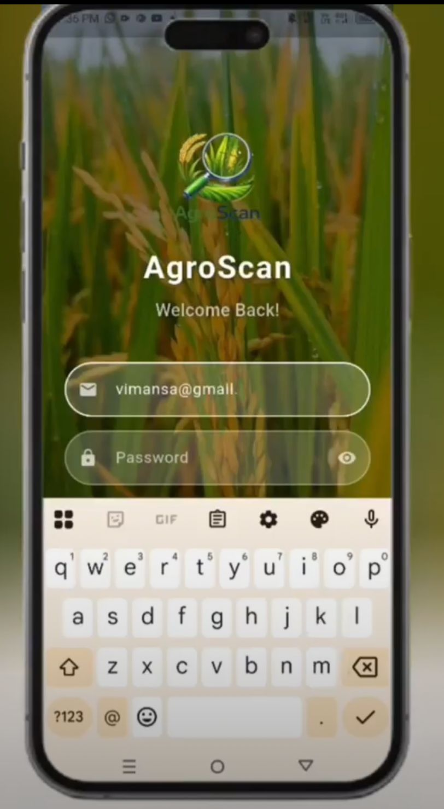
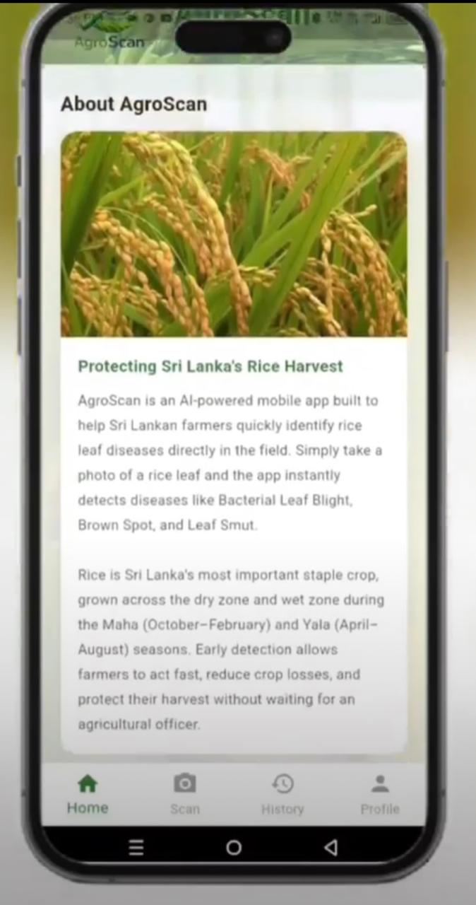
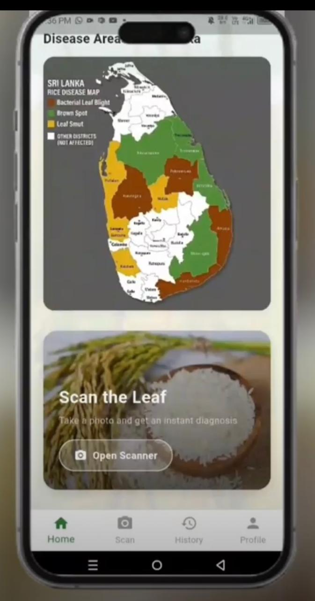
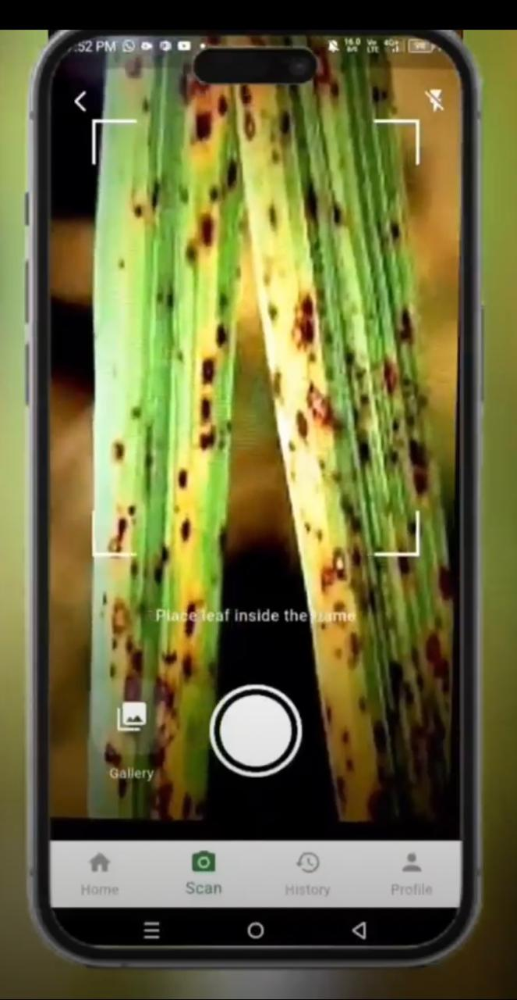
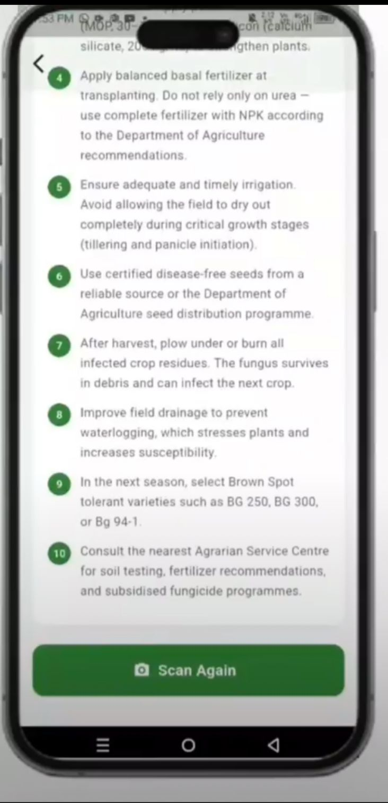
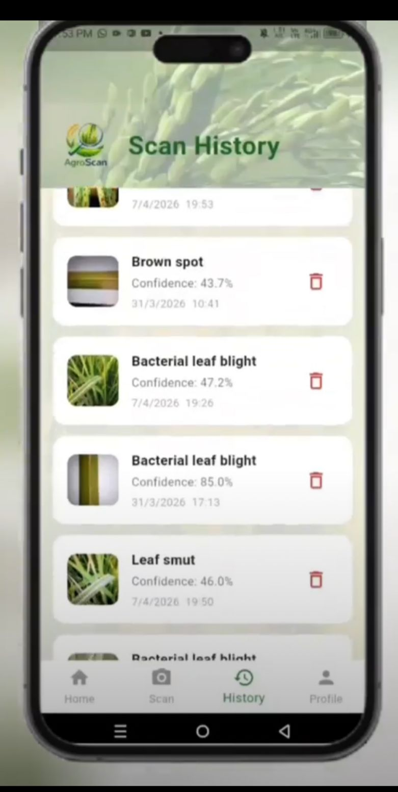
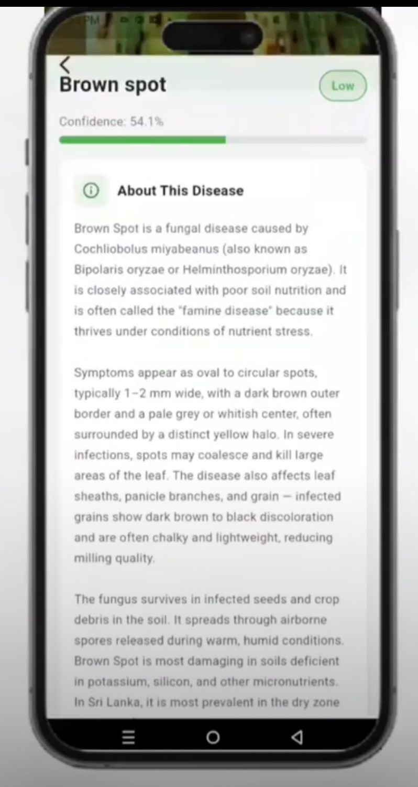

# 🌾 AgroScan — AI-Powered Rice Leaf Disease Detection

<p align="center">
  
</p>

<p align="center">
  A Flutter mobile application that helps Sri Lankan farmers detect rice leaf diseases instantly using on-device AI.
</p>

<p align="center">
  
  
  
  
</p>

---

## 📱 Overview

AgroScan is a solo-developed mobile app designed for Sri Lankan rice farmers. Using a custom-trained **EfficientNetB3** CNN model converted to **TensorFlow Lite**, the app performs real-time, on-device disease classification — no internet connection required for scanning.

Rice is Sri Lanka's most important staple crop. Early disease detection allows farmers to act fast, reduce crop losses, and protect their harvest without waiting for an agricultural officer.

---

## ✨ Features

- 📷 **Live Camera Scanning** — Point and shoot to detect disease instantly
- 🖼️ **Gallery Upload** — Classify from existing photos
- 🗺️ **Sri Lanka Disease Map** — Visual regional prevalence of each disease
- 📋 **Detailed Disease Info** — Causes, symptoms, and treatment recommendations
- 🕓 **Scan History** — Firestore-backed history with confidence scores and timestamps
- 🔐 **Firebase Authentication** — Secure user login and registration
- 👤 **User Profile & Analytics** — Personal scan statistics dashboard

---

## 🧠 AI Model

| Detail | Value |
|---|---|
| Architecture | EfficientNetB3 |
| Framework | TensorFlow → TensorFlow Lite |
| Dataset | ~300 images (~100 per class) |
| Classes | Bacterial Leaf Blight, Brown Spot, Leaf Smut |
| Test Accuracy | **83.33%** |
| Inference | On-device (no internet required) |

---

## 📸 Screenshots
<p align="center">
  
  
  
  
  
  
  
</p>

---

## 🛠️ Tech Stack

- **Frontend:** Flutter (Dart)
- **ML Model:** TensorFlow Lite (EfficientNetB3)
- **Backend/Auth:** Firebase Authentication
- **Database:** Cloud Firestore
- **Design:** Figma

---

## 🚀 Getting Started

### Prerequisites
- Flutter SDK 3.x
- Android Studio / VS Code
- Firebase project (with Auth and Firestore enabled)

### Installation

```bash
# Clone the repository
git clone https://github.com/Vimansa-Siyasing/agroscan_app.git

# Navigate to project directory
cd agroscan_app

# Install dependencies
flutter pub get

# Run the app
flutter run
```

### Firebase Setup
1. Create a Firebase project at [console.firebase.google.com](https://console.firebase.google.com)
2. Enable **Email/Password** Authentication
3. Enable **Firestore Database**
4. Download `google-services.json` and place it in `android/app/`

---

## 🌿 Disease Classes

| Disease | Description |
|---|---|
| **Bacterial Leaf Blight** | Water-soaked to yellowish stripes on leaf margins, caused by *Xanthomonas oryzae* |
| **Brown Spot** | Oval brown spots with yellow halo, caused by *Cochliobolus miyabeanus* |
| **Leaf Smut** | Small, angular, black spots on leaf surface caused by *Entyloma oryzae* |

---

## 👨‍💻 Developer

**Vimansa Siyasinghe**  
BSc (Hons) Software Engineering — NSBM Green University  
[GitHub](https://github.com/Vimansa-Siyasing) · [LinkedIn](https://www.linkedin.com/in/vimansa-siyasinghe-1b74103a8)

---
